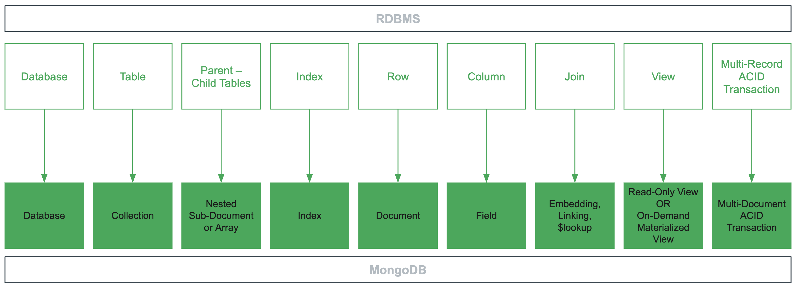

**Theory**

**Quizzes**

Problem:
Which of the following are some of the main features of MongoDB?

- [X] Scalability allows to seamlessly scale across multiple servers to store and process data.
- [X] MongoDB lets you move data where you need it, so you can keep data near users.
- [X] Fault tolerance is natively built into MongoDB by keeping redundant copies of the same data on different servers.
- The MongoDB query language is optimized to pull data from many collections at once.

Problem:
Which are correct statements about NoSQL databases?

- [X] NoSQL databases were designed to scale large datasets horizontally.
- NoSQL database scale better vertically than traditional relational databases.
- [X] Most NoSQL databases have built-in modern features like data redundancy and tolerance to failures.

Problem:
Which of the following terms is used in MongoDB to map the concept of a row in RDBMS?

- field
- key
- [X] document
- collection
- row

Problem:
Which of the following terms is used in MongoDB to map the concept of a table in RDBMS?

- field
- key
- document
- [X] collection
- row

Problem:
Which statements are good descriptions of the Document Model used in MongoDB?

- [X] It allows us to model one-to-one and one-to-many relationships.
- [X] It is similar to maps in Java and dictionaries in Python.
- It is identical to JSON.

Problem:
Which of the following set of operations guarantee ACID data integrity?

- [X] Modify a field and array in a single document within a MongoDB transaction.
- [X] Modify two documents within a MongoDB transaction.
- Modify two documents without using a MongoDB transaction.
- [X] Modify a field and array in a single document without using a transaction.

Problem:
What are the main reasons distributed systems behave differently than single server systems?

- [X] Networks are a common point of failure.
- More servers equate to more downtime.
- [X] Network speed is usually fast, but not instantaneous.

Problem:
Which one of the following are true about read/write preferences and concerns?

- The read preference tells the required durability requested for the read operation.
- [X] The read concern tells the required durability requested for the read operation.
- [X] The read preference tells which server to read data from.
- The write concern tells which server to write data to.
- [X] The write concern tells the required durability requested for the write operation.