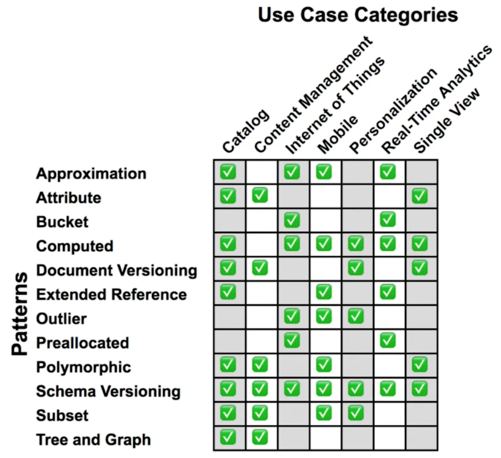

**Theory**

- Computed Pattern
- Bucket Pattern
- Extended References

**Quizzes**

Problem:
Which of the following should you keep in mind when you design a data model with MongoDB?

- [X] The document model encourages keeping related information together.
- [X] MongoDB supports ACID with the document model and with transactions.
- [X] MongoDB is a distributed database.

Problem:
Which are the three phases of our data modeling methodology?

- Draw an Entity-Relationship Diagram.
- [X] Model the Relationships.
- [X] Apply Patterns.
- [X] Describe the Workload.
- Write the Application Code.

Problem:
Which one of the following is the best reason to describe the workload as the first phase of the methodology?

- [X] Different workloads could lead to different data model solutions.
- There is only one solution to data normalization.
- A solution for a huge amount of data requires an entity relationship diagram.
- Because you want to apply schema design patterns.

Problem:
Which of the following would be a qualitative aspect of a write operation?

- The operation happens 1000 times per second.
- [X] The operation requires a durability of "majority."
- The data written should be destroyed in 1 year.
- The operation must be acknowedged back to the client in 10 ms.

Problem:
Which of the following criteria influence the choice of embedding instead of referencing a given relationship?

- [X] The two entities are always read together.
- [X] The two entities have a one-to-many relationship and are always modified together.
- One entity can be related to 10 million entities in the second table.

Problem:
The queries on a application are mostly on users. In other words, it it user-centric.

Each user can have many addresses. The addresses and the user are always read or updated together.

How should you model the relationship between the user and the addresses in MongoDB?

- The address document should reference a collection holding the user document.
- [X] The addresses should be embedded as an array in the user document.
- The user document should reference a collection holding the address documents.
- The user should be a subdocument in the address document.

Problem:
Which of the following are true statements about schema design patterns?

- [X] They often are denormalizations or transformations to improve performance.
- [X] They are a common language to understand design intents.
- They help normalize the data model.

Problem:
How are schema design patterns used in modeling for MongoDB?

- [X] They are applied when needed for a given use case.
- They are all applied to all use cases.
- They normalize the data model.